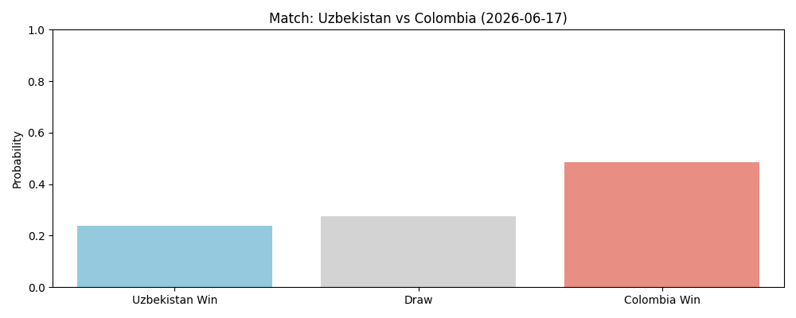
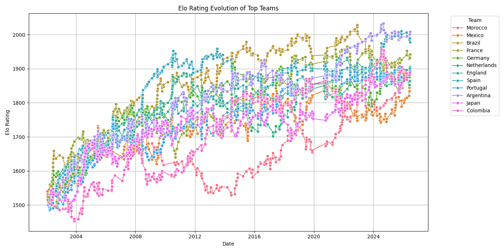

# 🏆 Dynamic World Cup 2026 Prediction

**A local-execution ML pipeline for FIFA World Cup 2026 match outcome and scoreline prediction — with rich static & interactive visualizations pushed to GitHub.**

Predictions and evaluations are driven by the **official World Cup 2026 schedule and results** (104 matches, group stage through the Final), with no API key required.

---

## Table of Contents

- [Overview](#overview)
- [Repository Structure](#repository-structure)
- [Setup](#setup)
- [Running the Scripts](#running-the-scripts) — including **from Jupyter / Anaconda**
- [Daily Workflow](#daily-workflow)
- [Predicting Any Single Match](#predicting-any-single-match)
- [Visualizations](#visualizations)
- [Methodology](#methodology)
- [Continuous Integration](#continuous-integration)
- [Known Limitations & Roadmap](#known-limitations--roadmap)
- [References](#references)

---

## Overview

This project predicts two things for every World Cup 2026 match:

| Task | Approach |
|---|---|
| **Match outcome** (Home / Draw / Away) | RandomForestClassifier over Elo difference & rolling form |
| **Exact scoreline** (goals per team) | Elo-adjusted Poisson model — a simplified Dixon-Coles approximation |

Both models are part of a **dynamic learning loop**: every time you run the pipeline, it checks the official schedule for newly-finished matches, evaluates how well they were predicted, and retrains both models on everything played so far — all the way through to the Final.

**Data sources** (no account or API key needed for either):
- [`openfootball/worldcup.json`](https://github.com/openfootball/worldcup.json) — the official World Cup 2026 fixture list and results, community-maintained, updated roughly daily.
- [`martj42/international_results`](https://github.com/martj42/international_results) — a broad historical international-results dataset, used so every team starts with a real Elo/form baseline instead of a flat default.

---

## Repository Structure

```text
.
├── data/
│   ├── raw/
│   │   ├── worldcup2026_results.parquet   # snapshot of all finished WC2026 matches (overwritten each run)
│   │   └── upcoming_matches_<date>.parquet
│   └── tournament_logs/
│       ├── predictions_<date>.parquet     # every prediction ever logged (one file per predict_matchday.py run)
│       ├── evaluated_matches.parquet      # match IDs already scored, so nothing is double-counted
│       ├── model_performance.csv          # Log-Loss / RMSE history, one row per evaluated match-date
│       └── elo_ratings_history.parquet
├── notebooks/
│   ├── 01_eda_elo.ipynb                   # exploratory only — NOT part of the daily pipeline
│   └── 02_baseline.ipynb                  # exploratory only — re-running it overwrites models/ with a simpler baseline
├── src/
│   ├── scraper.py                         # official schedule + historical baseline, no API key
│   ├── features.py                        # Elo ratings, rolling form, leak-free training-set builder
│   ├── model.py                           # match outcome (classifier) & scoreline (Poisson) models
│   └── visualize.py                       # static (Matplotlib/Seaborn) & interactive (Plotly) plots
├── plots/                                 # generated charts — .png and .html
├── models/                                # trained model artifacts (.joblib)
├── .github/workflows/sanity-check.yml     # CI: installs deps, byte-compiles, smoke-tests imports
├── predict_matchday.py                    # run BEFORE the next official matchday
├── update_and_evaluate.py                 # run AFTER matches conclude (safe to run daily, any day)
├── predict_single_match.py                # ad-hoc: predict ANY two teams, official fixture or not
├── requirements.txt
├── .gitignore
├── LICENSE
└── README.md
```

---

## Setup

```bash
git clone https://github.com/fridoomk/Dynamic-World-Cup-2026-Prediction.git
cd Dynamic-World-Cup-2026-Prediction
python3 -m venv venv
source venv/bin/activate   # Windows: venv\Scripts\activate
pip install -r requirements.txt
```

That's it — no API key, no account, no `.env` file needed. Both data sources used by `src/scraper.py` are free and public.

---

## Running the Scripts

This project's `.py` files are meant to be run as standalone scripts, not opened as notebooks — but if you're coming from Anaconda/Jupyter, here are three equally valid ways to run them, pick whichever feels comfortable:

**Option A — Anaconda Prompt / terminal (recommended for this project):**
```bash
cd path/to/Dynamic-World-Cup-2026-Prediction
conda activate your_env_name      # if you use a conda environment
python predict_matchday.py
```

**Option B — from inside a Jupyter notebook**, using the `!` shell-escape or the `%run` magic:
```python
# in a notebook cell, from the project's root folder
!python predict_matchday.py

# or, equivalent and shows print() output the same way:
%run predict_matchday.py
```
`%run` is generally preferred over `!python` in Jupyter because it shares the notebook's working directory more reliably and shows tracebacks in the usual Jupyter style.

**Option C — Anaconda Navigator → Jupyter → "Terminal"** (not a notebook, but launched from the same app): Anaconda Navigator's Jupyter interface has a "New → Terminal" option in the file browser — that opens a real terminal in your browser where `python predict_matchday.py` works exactly like Option A.

A quick mental model: a **notebook** (`.ipynb`) is for interactive, cell-by-cell exploration — that's what `01_eda_elo.ipynb` and `02_baseline.ipynb` are for. A **script** (`.py`) is meant to run top-to-bottom in one go and then exit — that's `predict_matchday.py`, `update_and_evaluate.py`, and `predict_single_match.py`. Both can be launched from the same Anaconda environment; they're just different tools for different jobs.

---

## Daily Workflow

You can run this on any cadence you like — daily, or whenever you want to check in — without worrying about exactly which matches happened "yesterday". Both scripts figure that out from the official schedule itself.

### Before the next matchday → `predict_matchday.py`

1. Fetches the official schedule and finds the next unplayed date's fixtures (could be one match or several, on busier group-stage days).
2. Generates outcome + scoreline predictions for each, using the currently-saved models.
3. Logs them to `data/tournament_logs/predictions_<run-date>.parquet` and updates `plots/next_matchday_predictions.png`.

```bash
python3 predict_matchday.py
```

### After matches conclude → `update_and_evaluate.py`

1. Re-fetches the official schedule, snapshots every finished match to `data/raw/worldcup2026_results.parquet`.
2. Compares finished matches against everything ever logged in `predictions_*.parquet`, evaluates only the ones **not already scored** (tracked in `evaluated_matches.parquet`) — so running this every day, twice a day, or only once a week all give the same correct result with no double-counting.
3. Appends Log-Loss / RMSE to `data/tournament_logs/model_performance.csv` and refreshes the leaderboard plot.
4. Retrains both models on the full history (broad baseline + every official result so far) and updates the Elo evolution plots.

```bash
python3 update_and_evaluate.py
```

Run `predict_matchday.py` again afterward to get a fresh prediction for the next fixture. Repeat this cycle through the group stage, knockout rounds, and the Final — commit `data/`, `models/`, and `plots/` to git as often as you like to keep a public history of how the models evolved.

```bash
git add data/ models/ plots/
git commit -m "World Cup 2026: update for <date>"
git push origin main
```

---

## Predicting Any Single Match

`predict_matchday.py` only predicts official fixtures. For a friendly, qualifier, or just curiosity about a head-to-head that isn't on the World Cup schedule, use `predict_single_match.py` with the same trained models:

```bash
python3 predict_single_match.py --home "Uzbekistan" --away "Colombia"
```

It prints the outcome probabilities, expected goals, and the most likely scorelines, and saves a chart to `plots/single_match_<home>_vs_<away>.png` — separate from the official matchday plot, so it never overwrites it.

---

## Visualizations

**Next matchday predictions** — outcome probability for the next official fixture(s):



**Elo rating evolution** — top 12 teams by current rating:



An interactive Plotly version lives at [`plots/model_evolution_elo_interactive.html`](plots/model_evolution_elo_interactive.html) (download it or serve it via [GitHub Pages](https://pages.github.com/) — GitHub won't render HTML inline). It loads Plotly.js from a CDN rather than embedding it, so the file stays in the tens-of-KB range.

**Model accuracy leaderboard** — Log-Loss / RMSE per evaluated match-date — appears at `plots/model_accuracy_leaderboard.png` once `update_and_evaluate.py` has scored at least one finished match.

---

## Methodology

- **Elo ratings** capture relative team strength and update after every result (K-factor 30, starting rating 1500).
- **Rolling form** is each team's average points-per-game (win=1, draw=0.5, loss=0) over its last 5 matches.
- **Match outcome model**: RandomForestClassifier over Elo difference and form difference → P(Home), P(Draw), P(Away).
- **Scoreline model**: independent Poisson rates per team, nudged up/down per match by the Elo difference — a lightweight, match-aware approximation rather than a single global average for every fixture.
- **Leak-free training**: `src/features.build_training_dataset()` walks historical matches in date order, snapshotting each team's Elo/form *immediately before* that match, so the model is never trained on information it couldn't have known at the time.
- **Evaluation**: Log-Loss for outcome calibration, RMSE (expected vs. actual goals) for scoreline accuracy, computed once per match and never recomputed — tracked in `model_performance.csv` to watch the model improve as the tournament progresses.

---

## Continuous Integration

A lightweight GitHub Actions workflow (`.github/workflows/sanity-check.yml`) runs on every push and pull request: installs `requirements.txt`, byte-compiles every module, and smoke-tests that all `src/` modules import cleanly.

---

## Known Limitations & Roadmap

- **Schedule data freshness** — `openfootball/worldcup.json` is updated roughly once a day by hand, not instantly after a final whistle; if you need same-minute live scores, swap `fetch_worldcup_2026_schedule()` for a paid real-time provider.
- **Feature depth** — no player-level data, squad changes, or travel/rest-day effects yet.
- **Scoreline model** — the Elo-adjusted Poisson approach is still a simplification; a full Dixon-Coles implementation would likely outperform it.
- **Automation** — the CI workflow only sanity-checks the code; running `predict_matchday.py` / `update_and_evaluate.py` on a schedule (e.g. GitHub Actions cron) and auto-committing results is a natural next step.
- **Containerization** — a Dockerfile would make the local environment reproducible across machines.

---

## References

- Elo rating system — [Wikipedia](https://en.wikipedia.org/wiki/Elo_rating_system)
- Poisson distribution — [Wikipedia](https://en.wikipedia.org/wiki/Poisson_distribution)
- Dixon, M. & Coles, S. (1997). *Modelling Association Football Scores and Inefficiencies in the Football Betting Market* — [PDF](https://www.football-data.co.uk/Dixon-Coles.pdf)
- Official schedule & results — [openfootball/worldcup.json](https://github.com/openfootball/worldcup.json)
- Historical international results — [martj42/international_results](https://github.com/martj42/international_results)

---

**Author:** Fridoom
**License:** MIT
**Last updated:** June 2026
